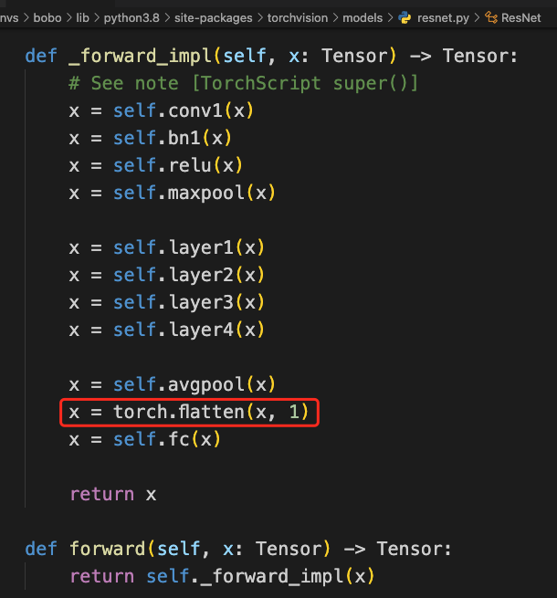
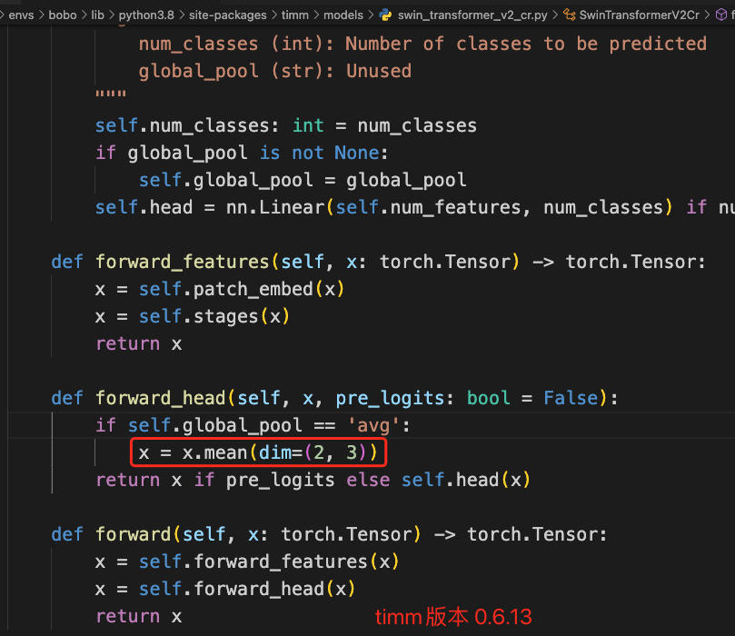
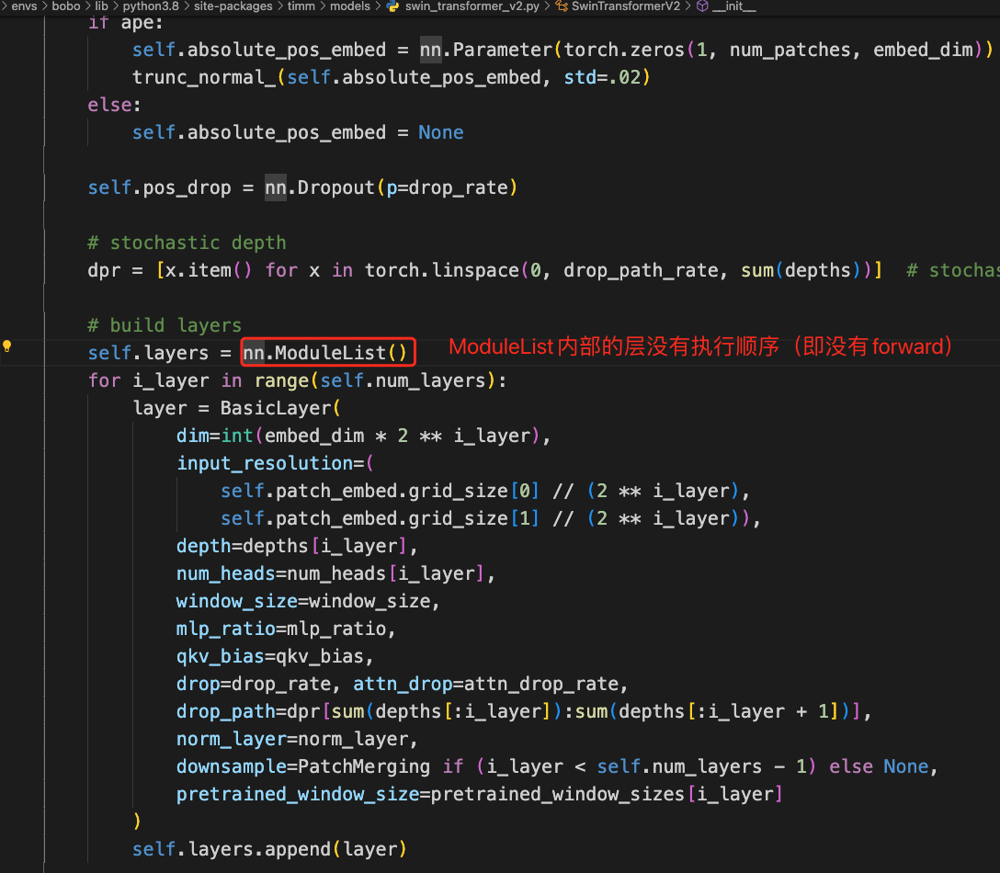
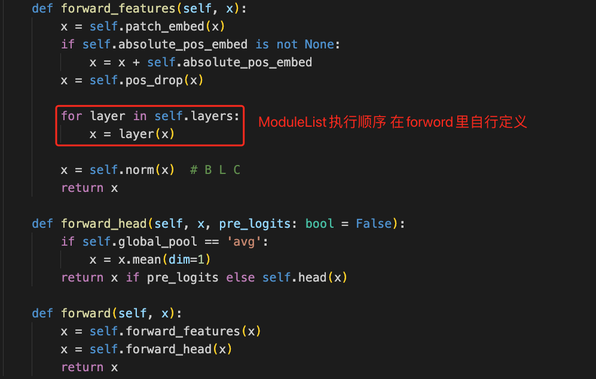

# 流水并行-模型库


# Timm版本 0.9.2

安装命令 `pip install git+https://github.com/huggingface/pytorch-image-models.git@v0.9.2`

## 1. swinv2_large_window12to16_192to256_22kft1k

196M 参数量

```python
with pipelinable:
    import timm
    model = timm.create_model("swinv2_large_window12to16_192to256_22kft1k")
exec_seq = ["patch_embed", "layers", "norm", "head"]
```

## 2. convnext_xlarge.fb_in22k_ft_in1k_384

350M 参数量

```python
with pipelinable:
    import timm
    model = timm.create_model("convnext_xlarge_in22ft1k")
exec_seq = ["stem", "stages", "norm_pre", "head"]
```


# Timm版本 0.6.7

## 1. ResNet50

25M参数量



```python
with pipelinable:
  from torchvision.models import resnet50
  model = resnet50()
exec_seq = [
    'conv1', 'bn1', 'relu', 'maxpool', 'layer1', 'layer2', 'layer3', 'layer4', 'avgpool',
    (lambda x: torch.flatten(x, 1), "behind"), #丢失的操作
  	'fc',
]
pipelinable.to_layer_list(exec_seq)
```


## 2. swinv2_cr_small_ns_224

50M参数量



```python
with pipelinable:
  	import timm
    model = timm.create_model("swinv2_cr_small_ns_224", pretrained=False)
exec_seq = [
    "patch_embed",
    "stages",
    (lambda x: x.mean(dim=(2, 3)), "mean"), #丢失的操作
    "head",
]
pipelinable.to_layer_list(exec_seq)
```


## 3. swinv2_large_window12to16_192to256_22kft1k

196M参数量   无法模型并行





## 4. convnext_xlarge_in22ft1k

350M参数量

```python
with pipelinable:
    import timm
    model = timm.create_model(
        "convnext_xlarge_in22ft1k",
        pretrained=False,
    )
exec_seq = ["stem", "stages", "head"]
pipelinable.to_layer_list(exec_seq) 
```


