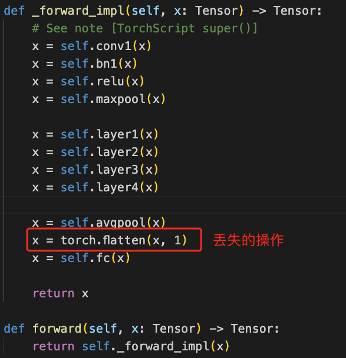

# 流水并行：自定义模型拆分

colossalai支持

- balanced(默认)：按参数大小平衡，自动拆分

- uniform：按层均匀，自动拆分

- customized：自定义拆分

  ​    需与exec_seq配合

  ```python
  exec_seq = [
    "xxx",
    "SPLIT_NODE",  # 拆分标志位
    "xxx",
  ]
  ```


问题：自动拆分策略，导致

​			（1）GPU负载不均衡：卡1显存跑满，但卡2几乎无占用

​			（2）通用性不强：丢失部分算子，导致训练失败。

解决：自定义手动拆分。

> 以下内容官方API教程没有，属于colossalai隐藏API的探索使用


# 自定义模型拆分

| 依赖        | 版本   |
| ----------- | ------ |
| colossalai  | 0.2.8  |
| torch       | 1.13.1 |
| torchvision | 0.14.1 |
| cuda        | 11.6   |


## 1. 打印网络结构

```python
from torchvision.models import resnet50
model = resnet50()
print(model)
```

打印模型结构，即各层执行顺序

```shell
ResNet(
  (conv1): Conv2d(3, 64, kernel_size=(7, 7), stride=(2, 2), padding=(3, 3), bias=False)
  (bn1): BatchNorm2d(64, eps=1e-05, momentum=0.1, affine=True, track_running_stats=True)
  (relu): ReLU(inplace=True)
  (maxpool): MaxPool2d(kernel_size=3, stride=2, padding=1, dilation=1, ceil_mode=False)
  (layer1): Sequential(
    (0): xxx
    (1): xxx
    (2): xxx
  )
  (layer2): Sequential(
    (0): xxx
    (1): xxx
    (2): xxx
    (3): xxx
  )
  (layer3): Sequential(
    (0): xxx
    (1): xxx
    (2): xxx
    (3): xxx
   	(4): xxx
    (5): xxx
  )
  (layer4): Sequential(
    (0): xxx
    (1): xxx
    (2): xxx
  )
  (avgpool): AdaptiveAvgPool2d(output_size=(1, 1))
  (fc): Linear(in_features=2048, out_features=1000, bias=True)
)
```

## 2. 手动拆分

- 假设流水并行为2，故需拆分2段。 

- "SPLIT_NODE"为拆分标识位。 

  > 根据显存负载，手动调整标志位位置。

```python
exec_seq = [
  "conv1",
  "bn1",
  "relu",
  "maxpool",
  "SPLIT_NODE",  # 此处拆分为两段
  "layer1",
  "layer2",
  "layer3",
  "layer4",
  "avgpool",
  "fc",
]
```

设置流水并行

- 示例`hybrid/train.py`  ，由<u>自动拆分</u>改为<u>自定义拆分</u>

```python
with pipelinable:
    model = resnet50() # 初始化模型
pipelinable.to_layer_list(exec_seq) # 上述确定的执行序列
pipelinable.policy = "customized"  # 自定义拆分策略
```

运行将报错，原因为exec_seq序列丢失部分算子，补足即可

```bash
  File "/opt/conda/envs/bossvision/lib/python3.8/site-packages/torch/nn/modules/module.py", line 1194, in _call_impl
    return forward_call(*input, **kwargs)
  File "/opt/conda/envs/bossvision/lib/python3.8/site-packages/torch/nn/modules/linear.py", line 114, in forward
    return F.linear(input, self.weight, self.bias)
RuntimeError: mat1 and mat2 shapes cannot be multiplied (4096x1 and 2048x1000)
```

## 3. 解决方案

1. 查看模型定义，定位丢失的算子



2. 补足算子即可

   ```python
   exec_seq = [
       "conv1",
       "bn1",
       "relu",
       "maxpool",
       "layer1",
       "layer2",
       "SPLIT_NODE",  # 此处拆分为两段
       "layer3",
       "layer4",
       "avgpool",
       (lambda x: torch.flatten(x, 1), "flatten"), # 补足算子  命名随意
       "fc",
   ]
   ```


# 可选功能

## 1. 多级拆分

示例

```python
exec_seq = [
  "conv1",
  "bn1",
  "relu",
  "maxpool",
  "layer1.0",
  "layer1.1",
  "SPLIT_NODE",  # 此处拆分为两段
  "layer1.2",
  "layer2",
  "layer3",
  "layer4",
  "avgpool",
  "fc",
]
```

## 2. 增大总batch

功能类似梯度累积，[更多详情](https://colossalai.org/zh-Hans/docs/features/pipeline_parallel)

示例`hybrid/train.py`  ，增大2倍。

```python
# 交错式Schedule  
# (1)总batch被划分为N个micro_batches,
# (2)micro_batches数量为流水线阶段的整数倍
NUM_MICRO_BATCHES = parallel["pipeline"] * 2
```

