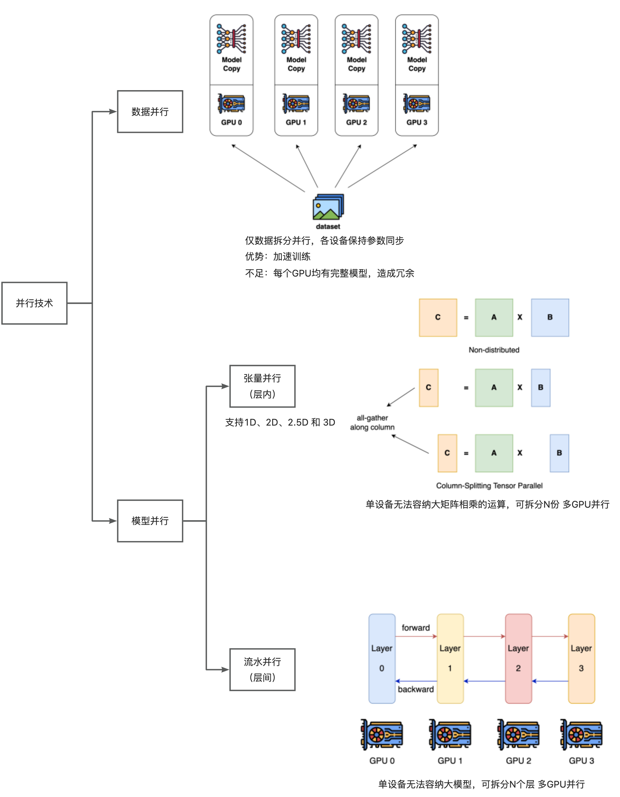
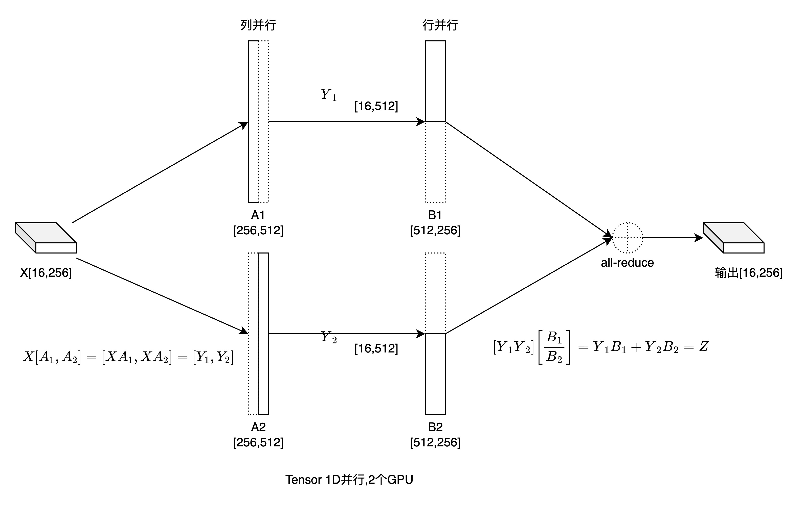

# 一起来训大模型

- 该仓库收录于[PytorchNetHub](https://github.com/bobo0810/PytorchNetHub)
- [ColossalAI官网](https://www.colossalai.org/zh-Hans/)   [文档](https://www.colossalai.org/zh-Hans/docs/get_started/installation/)

## 最小示例

### Tensor并行

- 1D并行  `examples/tp.py`

## 总结

- GPU总数量= 数据并行大小 × 张量并行大小 × 流水并行大小，三者可同时应用
- 指定 张量并行、流水并行的大小，则自动推断数据并行大小
- Engine包含 模型、优化器、损失函数。
- fp16与ZeRO配置不兼容

### 流水并行

- 仅支持navie amp自动混合精度
- 仅支持nn.Sequential序列模型
- 支持engine

### 待学习

- ColoTensor ：Pytorch Tensor子类，全局tensor，串行编写，分布训练
- 1D\2D\2.5D\3D Tensor并行
- 流水并行

