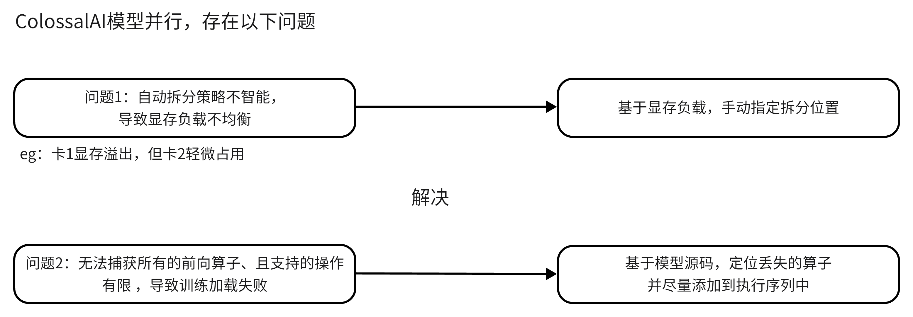
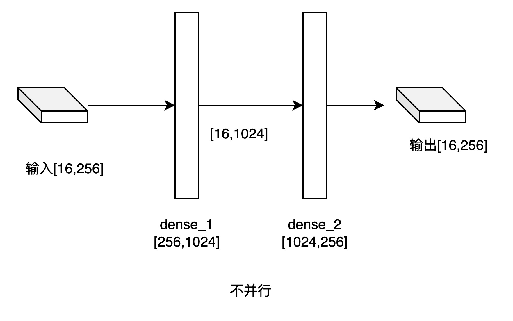
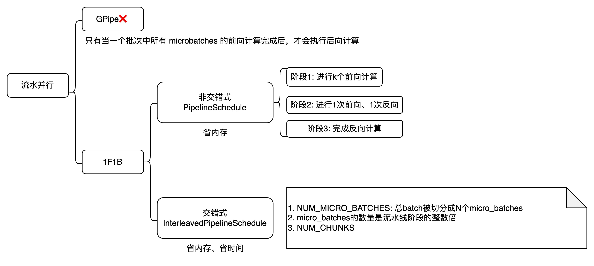
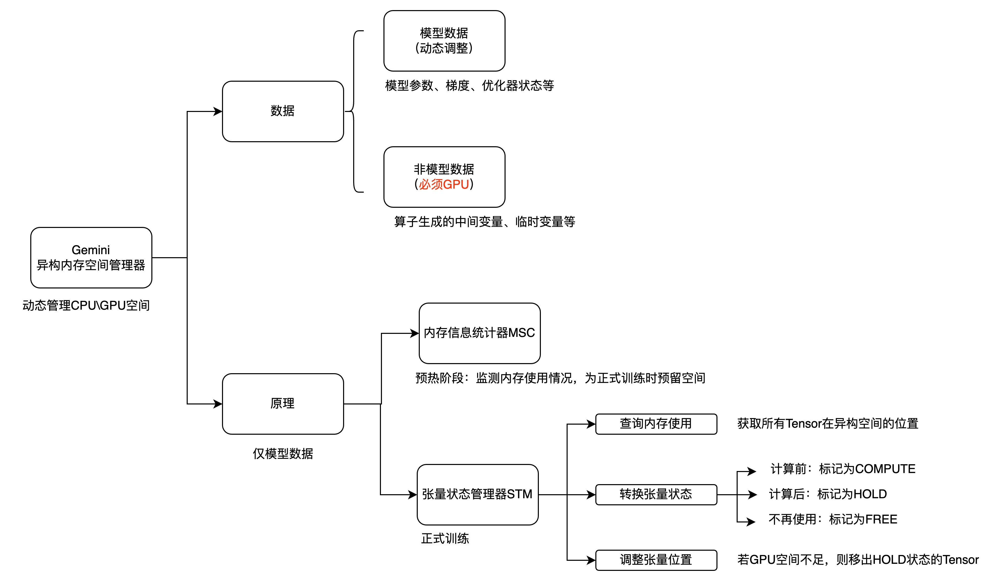
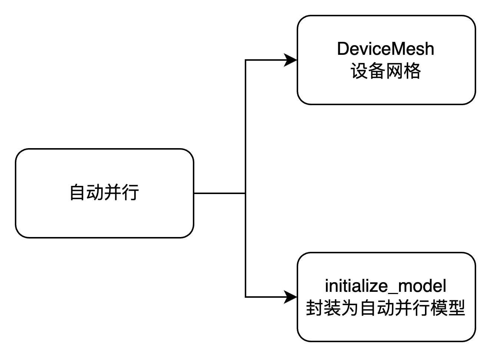

# 大模型食用手册

- 该仓库收录于[PytorchNetHub](https://github.com/bobo0810/PytorchNetHub)
- [ColossalAI官网](https://www.colossalai.org/zh-Hans/)   [文档](https://www.colossalai.org/zh-Hans/docs/get_started/installation/)

## 大模型方案

## 总结

- GPU总数量= 数据并行大小 × 张量并行大小 × 流水并行大小

  > 指定 张量并行、流水并行的大小，则自动推断数据并行大小

- Engine： 对模型、优化器、损失函数的封装类。

- fp16与ZeRO配置不兼容

## 注意

- 配置文件的batch 指单个进程的batch。 故总batch 是Nx batch
- 配置文件的epoch 指单个GPU上的epoch。 故总epoch 是Nx epoch

> 举例：每个gpu上的dataloader都是完整的数据集，未做拆分。 epoch=3  数据并行=2时模型实际上过了6遍数据集

## 实验

| 模型名称           | 参数量 | 输入尺寸 | batch（数据并行->流水并行） | 提升  |
| ------------------ | ------ | -------- | --------------------------- | ----- |
| swinv2_large       | 196M   | 256×256  | 90->120                     | 33%↑  |
| convnext_xlarge    | 350M   | 224×224  | 140->200                    | 43%↑  |
| tf_efficientnet_l2 | 480M   | 800×800  | 1->4                        | 300%↑ |
| eva_giant          | 1013M  | 336×336  | 6->？                       |       |

 [更多详情](examples/hybrid/流水并行-模型库.md)

### 混合并行示例

- 数据并行+流水并行+Tensor并行   `examples/hybrid`

- 解决问题1：[自定义拆分教程](examples/hybrid/流水并行-自定义拆分.md)    
- 解决问题2：  [模型库](examples/hybrid/流水并行-模型库.md)

- 注：colossalai的官方API无此内容，属于隐藏的高级API。**"补足算子"**、**"自定义多级拆分"** 特性是基于读源码总结得出。

# 其他示例

### Tensor并行

- 1D并行  `examples/tp.py`

### 流水并行

  `examples/pp.py`

### 零冗余优化器ZeRO

  `examples/zero`

### 异构内存空间管理器Gemini

  `examples/zero`

### 自动并行AutoParallel(实验性)

api暂未稳定

